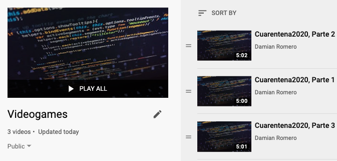
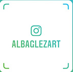

# Código, diseños y música para el *live coding* del videojuego "Cuarentena 2020"
## Contenido de entretenimiento con motivo de la cuarentena del 2020.
### © 2020, Damian Romero (damian.compling@gmail.com)

Video tutorial
=====

Dele click a la siguiente imágen para ver mi tutorial en YouTube:

[](https://www.youtube.com/playlist?list=PLf3tqePBaCoKzdipY9HN1ecQXz6IAd11E)

:octocat: Para usar los archivos en este repositorio:
 ====

#### 1. Diseños, efectos de sonido y música: Baja a tu computadora en un folder al que puedas acceder fácilmente los archivols: 
  - cuarentena.py  # Código para el videojuego (© Damián Romero)
  - covid.png  # Diseño (© Alba González)
  - chavito.png  # (© Alba González)
  - arriba.ogg  # (© Rodd Neyra)
  - abajo.ogg  # (© Rodd Neyra)
  - tos.ogg  # (© Rodd Neyra)
  - rola.mp3 # (© Rodd Neyra)
  - **\*Nota: Si quieres usar imágenes diferentes, puedes consultar la página de internet: https://opengameart.org/ en donde tienen imágines gratis para videojuegos. Probablemente necesites cambiar el tamaño de las imágenes y el fondo para que se vean bien en el juego. También hay música gratuita en: http://ccmixter.org/files/ pero debes usar formatos .ogg o .wav para efectos de sonido y .mp3 para la música.**

#### 2. Instala Python 3.7 o una versión más reciente en tu computadora. Este paso también depende de tu sistema operativo. Puedes verificar si tienes Python 3.7+ si escribes en tu consola ```python -V``` y te dice algo como esto:

```
╰─○ python -V
Python 3.7.7
```

Si no tienes python, tendrás que instalarlo. La manera más fácil de hacerlo es con un paquete que se llama "Anaconda" que se asegura de que todo se haya instalado correctamente. Te recomiendo que sigas las instrucciones del paso 1 al paso 3 del siguiente tutorial (__solo neceitas del paso 1 al 3, pero asegúrate de bajar Python 3.7 para tu sistema operativo__):

https://www.aprendemachinelearning.com/instalar-ambiente-de-desarrollo-python-anaconda-para-aprendizaje-automatico/


#### 3. Una vez que sepas que tienes python 3.7+, instala el módulo ```pygame``` así:
```
╰─○ python -V
pip install pygame
```

Una vez que la instalación sea exitosa, ya puedes correr el juego así:

#### 4. Ahora, dependiendo de tu sistema operativo debes de ir a tu consola, que es un programa en donde puedes correr los programas:

- WINDOWS: Abre el ```command prompt``` y navega hasta el folder en donde bajaste los archivos. Puedes encontrar el ```command prompt``` en el menú de búsqueda de Windows (dale click a la tecla de Windows y en el buscador escribe ```command prompt```. [Haz click aquí si no sabes qué el command prompt](https://es.wikipedia.org/wiki/S%C3%ADmbolo_del_sistema)

- MacOS o LINUX: Abre la consola buscando ```Terminal```. Puedes encontrar ```Terminal``` en el buscador. [Haz click aquí si no sabes qué Terminal](https://en.wikipedia.org/wiki/Linux_console)


#### 5. Para correr el videojuego:

Debes usar la consola para navegar a la carpeta de tu videojuego.

- WINDOWS: Puedes aprender a navegar tus directorios en la terminal de Windows [siguiendo este tutorial](https://riptutorial.com/es/cmd/example/8646/navegando-en-cmd)

- MacOS o LINUX: Puedes aprender a navegar tus directorios en la terminal de MacOS o Linux [siguiendo este tutorial](http://www.fis.unipr.it/pub/linux/redhat/9/en/doc/RH-DOCS/rhl-gsg-es-9/s1-navigating-cd.html) o [este otro](https://liz-fernandez.github.io/PBI_linux_shell/02-filedir/)

Una vez que llegaste a la consola debes de escribir la siguiente línea y darle enter:
```
╰─○ python cuarentena.py
```

- \*Todos los archivos deben de estar en la misma carpeta y debes de navegar a esta carpeta antes de poder correr el videojuego. 


#### 6. Para hacer cambios en el programa, abre el archivo "cuarentena.py" en un procesador de texto para programar.

- Te recomiendo mucho [Sublime Text 3](https://www.sublimetext.com/3) porque es gratuito y mu fácil de usar. Yo lo uso todo el tiempo.

#### 7. ¡Si quieres aprender a programar super poderes o a cambiar la dificultad del juego, mira mi video # 3!


# Créditos

### Diseño del juego.
> Damián Romero. Yo soy el diseñador del juego, pero me inspiré en varios tutoriales de RealPython.com, en especial en el artículo de Jon Fincher ["PyGame: A Primer on Game Programming in Python"](https://realpython.com/pygame-a-primer/). Si quieren aprender a programar en Python o a mejorar sus habilidades, no puedo recomendarles un mejor recurso que /realpython.com. Desafortunadamente, sus tutoriales están todos en inglés y espero que pronto añadan otros idiomas.

> Special thanks to Dan Bader and all the folks at Real Python for being a constant source of inspiration and knowledge!

### Arte gráfico

> **Todo el arte gráfico es gracias a Alba González**

> Puedes leer su nuevo proyecto de manera gratuita en: https://tinyurl.com/albag-Laura :wink:

> Visita su página de Patreon: https://www.patreon.com/albaglezart/

> ¡O síguela en Instagram!



### Música y efectos de sonido

> **Toda la música y los efectos de sonido son gracias a Rodd Neyra**

> ¡Síguelo en Instagram! 


# Anuncio Importamte

## <a rel="license" href="http://creativecommons.org/licenses/by-nc-nd/4.0/"></a><br />Los diseños gráficos: chavito.png, covid.png y los efectos de sonido y música: abajo.ogg, arriba.ogg, rola.mp3, tos.ogg, están bajo una <a rel="license" href="http://creativecommons.org/licenses/by-nc-nd/4.0/">licencia de Creative Commons Reconocimiento-NoComercial-SinObraDerivada 4.0 Internacional</a>


## Solamente pueden ser utilizados bajo las siguientes condiciones:

- Compartir — copiar y redistribuir el material en cualquier medio o formato
- La licenciante no puede revocar estas libertades en tanto usted siga los términos de la licencia

## Bajo los siguientes términos:

- Atribución — Usted debe dar crédito de manera adecuada, brindar un enlace a la licencia, e indicar si se han realizado cambios. Puede hacerlo en cualquier forma razonable, pero no de forma tal que sugiera que usted o su uso tienen el apoyo de la licenciante.
-  NoComercial — Usted no puede hacer uso del material con propósitos comerciales.
- SinDerivadas — Si remezcla, transforma o crea a partir del material, no podrá distribuir el material modificado.

### No hay restricciones adicionales en cuanto al uso del arte gráfico o de los efectos de sonido y la música — No puede aplicar términos legales ni medidas tecnológicas que restrinjan legalmente a otras a hacer cualquier uso permitido por la licencia. Para leer la licencia completa, sigue este vínculo: https://creativecommons.org/licenses/by-nc-nd/4.0/legalcode.es

# El software (código) y los documentos relacionados están protegidos por una licencia no comercial.

## La licencia de este demo del juego es una licencia restringida no comercial en la cual solamente se otorgan derechos de uso (no de distribución) con fines educativos. Consulta el archivo [LICENCIA-LICENCE.md](https://github.com/damian-romero/cuarentena_2020/blob/master/LICENCIA-LICENCE.md) para obtener más información.
