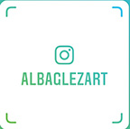

# Código, diseños y música de live coding para el videojuego "Cuarentena 2020"
## Convocatoria para creadores y artistas Contingencia COVID-19
### Secretaría de Cultura, MÉXICO

Para usar los archivos en este repositorio:

1. Baja a tu computadora en un folder al que puedas acceder fácilmente los archivols: 

- cuarentena.py  # Código para el videojuego (© Damián Romero)
- covid.png  # Diseño (© Alba Gonzáles)
- chavito.png  # (© Alba Gonzáles)
- arriba.ogg  # (© Rodd Neyra)
- abajo.ogg  # (© Rodd Neyra)
- tos.ogg  # (© Rodd Neyra)
- rola.mp3 # (© Rodd Neyra)

2. Ahora, dependiendo de tu sistema operativo debes de ir a tu consola, que es un programa en donde puedes correr los programas:

- WINDOWS: Abre el ```command prompt``` y navega hasta el folder en donde bajaste los archivos. Puedes encontrar el ```command prompt``` en el menú de búsqueda de Windows (dale click a la tecla de Windows y en el buscador escribe ```command prompt```. [Haz click aquí si no sabes qué el command prompt](https://es.wikipedia.org/wiki/S%C3%ADmbolo_del_sistema)

- MacOS o LINUX: Abre la consola buscando ```Terminal```. Puedes encontrar ```Terminal``` en el buscador. [Haz click aquí si no sabes qué Terminal](https://en.wikipedia.org/wiki/Linux_console)

- \*Todos los archivos deben de estar en la misma carpeta y debes de navegar a esta carpeta antes de poder correr el videojuego. 

3. Instala Python 3.7 o una versión más reciente en tu computadora. Este paso también depende de tu sistema operativo. Puedes verificar si tienes Python 3.7+ si escribes en tu consola ```python -V``` y te dice algo como esto:

```
╰─○ python -V
Python 3.7.7
```

Si no tienes python, tendrás que instalarlo. La manera más fácil de hacerlo es con un paquete que se llama "Anaconda" que se asegura de que todo se haya instalado correctamente. Te recomiendo que sigas las instrucciones del paso 1 al paso 3 del siguiente tutorial (__solo neceitas del paso 1 al 3, pero asegúrate de bajar Python 3.7 para tu sistema operativo__):

https://www.aprendemachinelearning.com/instalar-ambiente-de-desarrollo-python-anaconda-para-aprendizaje-automatico/


4. Una vez que sepas que tienes python 3.7+, instala el módulo ```pygame``` así:
```
╰─○ python -V
pip install pygame
```

Una vez que la instalación sea exitosa, ya puedes correr el juego así:

5. Una vez que sepas que tienes python 3.7+, instala el módulo ```pygame``` así:
```
╰─○ python cuarentena.py
pip install pygame
```

6. ¡Si quieres aprender a programar super poderes o a cambiar la dificultad del juego, mira mi video # 3!


# Créditos
- Yo soy el diseñador del juego, pero me inspiré en varios tutoriales de RealPython.com, en especial en el artículo de Jon Fincher ["PyGame: A Primer on Game Programming in Python"](https://realpython.com/pygame-a-primer/). Thanks to Dan Bader all the folks at Real Python for being a constant source of inspiration and knowledge!

- Todo el arte por Alba González

<a href="https://www.patreon.com/albaglezart/" target="_top">Download Page</a>

¡Síguela en Instagram! 



- Música por Rodd Neyra

¡Síguelo en Instagram! 

[@rodd.neyra]

<a rel="license" href="http://creativecommons.org/licenses/by-nc-nd/4.0/"></a><br />Los diseños gráficos: chavito.png, covid.png y los efectos de sonido y música: abajo.ogg, arriba.ogg, rola.mp3, tos.ogg, están bajo una <a rel="license" href="http://creativecommons.org/licenses/by-nc-nd/4.0/">licencia de Creative Commons Reconocimiento-NoComercial-SinObraDerivada 4.0 Internacional</a>.


## Solamente pueden ser utilizados bajo las siguientes condiciones:

- Compartir — copiar y redistribuir el material en cualquier medio o formato
- La licenciante no puede revocar estas libertades en tanto usted siga los términos de la licencia

## Bajo los siguientes términos:

- Atribución — Usted debe dar crédito de manera adecuada, brindar un enlace a la licencia, e indicar si se han realizado cambios. Puede hacerlo en cualquier forma razonable, pero no de forma tal que sugiera que usted o su uso tienen el apoyo de la licenciante.
-  NoComercial — Usted no puede hacer uso del material con propósitos comerciales.
- SinDerivadas — Si remezcla, transforma o crea a partir del material, no podrá distribuir el material modificado.

## No hay restricciones adicionales — No puede aplicar términos legales ni medidas tecnológicas que restrinjan legalmente a otras a hacer cualquier uso permitido por la licencia.

##Para leer la licencia completa, sigue este vínculo:

https://creativecommons.org/licenses/by-nc-nd/4.0/legalcode.es


